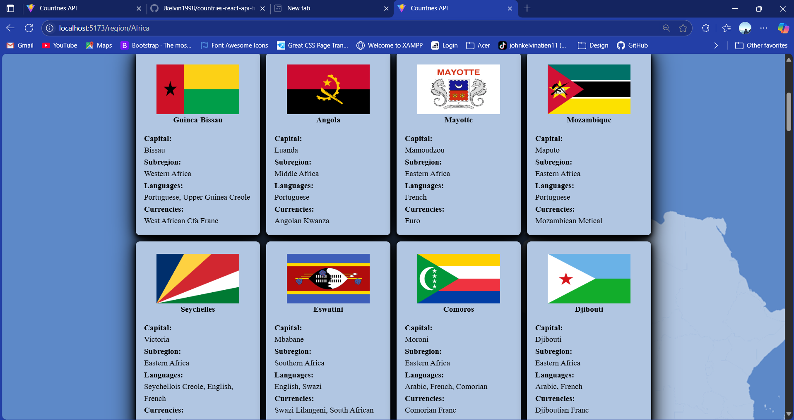

# Countries API React Project

This is a responsive React web application that displays information about countries by region using a public REST API. Users can browse regions, view flags, and explore country data.

---

## Features

- ✅ Browse regions of the world
- ✅ View country flags and names
- ✅ Fetch data from REST API
- ✅ Responsive design for mobile/tablet/desktop
- ✅ Built with React Router for navigation

---

## Screenshots



---

## Tech Stack

- React (Vite or Create React App)
- React Router DOM
- CSS
- REST Countries API

---

## Installation

```bash
# 1. Clone the repo
git clone https://github.com/your-username/your-repo-name.git

# 2. Navigate to the folder
cd your-repo-name

# 3. Install dependencies
npm install

# 4. Start the development server
npm run dev
```
Make sure you have Node.js and npm installed.

--- 

## API Reference

This app uses the REST Countries API.

Example Endpoint:
https://restcountries.com/v3.1/region/africa

---

## Folder Structure

src/
│
├── assets/             # Composed of Region images, Background and JSON loading animation
├── components/         # Reusable components (e.g., Header, CountriesCard)
├── data/               # Static data for region names
├── utils               # Loading animation configuration
├── hooks/              # Custom React hooks
├── pages/              # Page components (e.g., HomePage, RegionCountriesPage)
├── App.jsx             # Main App component
└── main.jsx            # React entry point